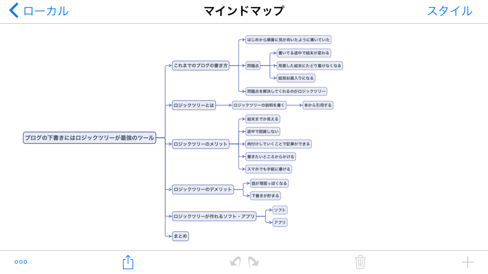
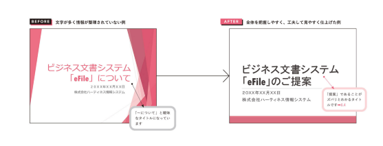

# ロジカルライティングとテクニカルライティング

## わかりにくい文章とは

1. 一文が長く，情報量が多い
2. 読み手を意識せず，自分視点で書いている
3. 基本的なライティング技術を活用していない

## 「目的」ありき．読んだ人の行動を想定する

読み手が何をすべきなのかがわかるように，書き手は「目的」を明確にしておく．

## 書き出す前にロジックを組み立てることが何よりも重要

情報を整理して，ロジックツリーを組み立てる


## 自己評価シート

* 読み手と目的を意識して書いている
* 全体の構成を決めてから書いている
* 一文が長くなりすぎないように気を付けている
* 文章のタイトルやメールの件名から目的が分かるように書いている
* 文と文のつながりを考えて書いている
* 重要な内容を先に書くようにしている
* 不要なことを書かないようにしている
* 文章を書いたら必ず見直してから提出している
* 発信日，宛先，発信者名を定説に入れて書いている
* 文章の読みやすさに配慮して書いている


# わかりやすく，簡潔な文章を書くテクニック

## 一文一義で書く

文を書くときに，「伝えたいことが多く，長くなってしまう」という人は，一文一義の文をいきなり書くのではなく，あらかじめ伝えたいキーワードを書き出して置きましょう．

各ポイントで最も伝えたいことは何かを明確にし，ポイントで述べる内容のキーワードを抜き出しておくと，伝えるべき情報が絞り込まれて行く．

キーワードを並べ，一緒に説明すべき情報はグルーピングしておきます．順番についても検討したら，抜き出したキーワードを盛り込みながら文を書いていく．

## 文を長くしない．「～(だ)が」，「～ので」で文をつながない

文が長くて読みにくいうえに，文の中で最も伝えたいことが文の最後に来ている．

## 一文を短く．50字以内でおさめるように

理解しやすい文の長さは50字以内

## 5W2Hを盛り込み，曖昧な文章にしない

* いつ
* どこで
* 誰が，誰に
* 何を
* なぜ
* どのように
* いくらで

## メールの件名，文章のタイトルから目的が伝わるように

目的をカッコ書きにしてメールの件名の冒頭に書く．
[要返信]や[依頼]など，社外メールの場合は「～のお願い」「ご確認ください」などの表現にするとよい．

## 「話し言葉」と「書き言葉」を使い分ける

| 品詞                 | 話し言葉             | 書き言葉             | 
| :------------------: | :------------------: | :------------------: | 
| 動詞（助動詞を含む） | ～していて           | ～しており           | 
|                      | ～していなくて       | ~しておらず          | 
|                      | ～してしまって       | ～したため           | 
|                      | ～しなくちゃいけない | ～しなければいけない | 
| 副詞                 | 全然                 | 全く                 | 
|                      | やっぱり             | やはり               | 
|                      | とても               | 非常に，大変         | 
|                      | もっと               | さらに               | 
|                      | いつも               | 常に                 | 
|                      | 絶対に               | 必ず                 | 
| 疑問詞               | どうして             | なぜ                 | 
|                      | どんな               | どのような           | 
| 指示詞               | こっち/そっち        | こちら/そちら        | 
|                      | こんなに/あんなに    | これほど/あれほど    | 
| 接続詞・接続助詞     | ～けれど             | ～が                 | 
|                      | ～から               | ～ため               | 
|                      | ～たら               | ～ば，～と           | 
|                      | ですから，だから     | そのため，したがって | 
| その他               | ～とか               | や                   | 
|                      | ～みたい             | ～のよう             | 
|                      | ～という             | ～の                 | 
|                      | ～なので             | ～のため             | 
|                      | すみません           | 申し訳ありません     | 

## 接続詞の使用は最小限に抑えて，効果的に使う

使わなくても意味が通じる箇所の接続詞が削除しましょう．
また，連続した番号で示せば，接続詞は不要です．

| 種類       | 接続詞                     | 
| ---------- | -------------------------- | 
| 順接       | したがって，それで，よって | 
| 逆説       | しかし，ところが           | 
| 並立       | また，および               | 
| 添加       | なお，そして               | 
| 説明・補足 | なぜなら，ただし，つまり   | 
| 対比・選択 | または，あるいは           | 
| 転換       | ところで，一方             | 

## 長くなりがちな文章を簡潔に仕上げるコツ

文章を簡潔にまとめたいと思いながら書いていても，どこを削ったら良いか迷った場合は，本文の冒頭の部分を中心に見直す．

多めに書いて削るのも良い．

# 読み手に伝わる文章を書くテクニック

## 形容詞や名詞句ではなく動詞でズバリと書く

before
```
セキュリティソフトウェアの適切な利用により，外部からの攻撃のリスクが低下します．
```
after
```
セキュリティソフトウェアを適切に使用してください．外部からの攻撃のリスクが低下します．
```

## 「～が必要です」は書き換える

before
```
新たにサービスをご利用いただくにが，会員登録が必要です．
```
after
```
新たにサービスをご利用になる時は，会員登録をしてください．
```

## 二重表現にしない
befor 「～しないと」，「～ない」と二重否定になっている例
```
フィルタリングソフトを適切に使わないと，青少年が有害サイトを閲覧することを防げない．
```
after 両方とも肯定にした例
```
フィルタリングソフトを適切に使えば，青少年が有害サイトを閲覧することを防げる．
```
after 前半は否定形を残し，後半の表現を書き直した(具体的にした)例
```
フィルタリングソフトを適切に使わないと，青少年が有害サイトを閲覧する危険がある
```
## どの程度危険なのか，わかりにくい曖昧な否定表現
「～しないとは限らない」
 before
```
水洗いを行うと，故障しないとは限りません．
```

より具体的な情報を盛り込み，肯定系に直す．

after
```
汚れは，水で濡らして絞った布でふき取ってください．全体を水に浸して，水洗いしないでください．内部に水が入り，故障につながります．
```

## 読み手がすべきことは能動態，結果は受動態で書く

操作説明書を書くときに，読み手であるユーザーがすべきことは，ユーザーを主語にして能動態で書く．その結果システムによって行われることは受動態で書く．

before
```
1. アプリのアイコンがタップされるとアプリが起動し，ログイン画面を表示します・
```
このままだと，タップするのは誰なのかわかりにくい.

after
```
1. アプリのアイコンをタップします．
  アプリが起動し，ログイン画面が表示されます．
```

## 「～となります」を使わず，書き手の主体性を伝えるようにかく
自分のすべきことや考えていることを書く時は，受け身の表現ではなく，能動態を使って書くことで，主体性が伝わる．

before
```
新たなサービスがお客様から求められるようになっている現状で，先生n的なサービスや技術の理解と経験が乏しいことが私の課題となります．
```
after
```
新たなサービスがお客様から求められるようになっています．私の課題は，先進的なサービスや技術の理解と経験が乏しいことです．こうした課題を解消するように学び，経験を増やすよう積極的に取り組みます．
```

## 具体的な対応を盛り込まないと，読み手は納得しない
5W2Hを忘れずに

## 「など」で例示を終わらせない

「など」は文章を曖昧にする代表的なもの．

before
```
本体のカバーを開けるときは，ボックスの四隅にあるネジを緩めてから開けます．ドライバーやレンチなどを用意してください．
```
上記の文章だとほかに何を用意すれば良いかわからなくなる．
after
```
本体のカバーを開けるときは，ボックスの四隅にあるネジを緩めてから開けます．ドライバーやレンチを用意してください
```
「など」を削除した例
after
```
本体のカバーを開けるときは，ボックスの四隅にあるネジを緩めてから開けます．ドライバーやレンチなどの工具を用意してください
```
「など」の後に例示をまとめるものを書き加えた例

## 箇条書きの最後の「など」は使わず，削除する

もしも他にあることを強調したいなら，箇条書きのタイトルに「●決済にお使いいただける電子マネー（一部）」と書いておく．

## 今後の取り組みや目標を示す時にも「など」は使わない

曖昧性をなくす

## レビューのチェックリスト

* タイトルから文章の目的がわかる
* 全体の構成がロジカルに組み立てられている
* ロジックが見出しからわかるように書かれている
* 文と文のつながりがある
* 必要な情報が盛り込まれている
* 不要な情報が書かれていない
* 一文が長すぎない．50字以下を目安に短く書いている．
* 話し言葉ではなく，書き言葉で書いている
* 敬語表現が適切に書かれている
* 表記の揺れがない
* 固有名詞が間違っていない
* 誤字，脱字がない


## 最後の文でしっかりと締めくくる

文章は最初と最後が肝心．

before
```
報告は，以上となります．
```
他人事のように感じる
after
```
今回の障害では大変，ご迷惑をおかけしましたことを重ねてお詫びいたします．上記のように再発防止に取り組み，●●システムをよりよくご活用いただけるように尽力します．
```
読み手の気持ちを動かすエモーショナルな表現．

## プレゼンテーション資料では，次へのアクションや双方向性を意識する．

before
```
ご清聴ありがとうございました
```

after
```
デジタルデータの活用がビジネスのスピードアップの原動力です．

ご質問，コメントをお願いします．
```
質問やコメントを促すスライドの例


## メールチェックリスト

* 件名と内容があっていて，目的が伝わる表現になっているか
* 宛先が適切に書いてあるか
* トピックを整理して，重要なことが書かれているか
* 必要な情報が具体的に書いてあるか
* 不要な情報の繰り返し表現がされていないか
* 話し言葉の表現になっていないか
* 誤字・脱字，固有名詞の間違いがないか
* 署名が適切に書いてあるか

# 読みやすさを高める文章のフォーマット～表現・表記のルール～

## 文章の冒頭に書かれる，文章を活用するための重要な手掛かり

必須な要素
「発信日」「宛先」「発信者名」「タイトル」
「いつ，誰に，誰が，何のために」書いたのかを示している情報．
一般的には文章の冒頭に記されます．

日付は／を用いずに，2020年12月6日のように書く方が良い．

## ブロック化して要素を区切る

読み手が自分が知りたい情報を拾い読みすることができる

ブロック化するには次のような方法がある．
* 改行し，行を分ける
* 右揃えや中央揃えをし，要素の配置を他と変える
* インデントを使って行頭を変える

メールなら食う行を入れてブロック化する

## 文章中では丸カッコと鍵カッコの2種類を使う

鍵カッコ：固有名詞であること，特定の語句を強調したい場合
丸カッコ：語句の言いかえや品番，製品名など
ex. 人工知能(AI)

## 補足や自分の意見を丸カッコで書かない
一文が長くなり，簡潔でない，読みにくい文章になる．

## ダブルクォーテーションを使わない
鍵カッコに書き換える．

## 文章中では明朝体とゴシック体の2種類を使いわける
本文は「明朝体」，見出しは「ゴシック体」

## 情報量が多い文章では，階層に分けて構造化する
階層構造は3階層程度までにする．
ページ数の多い取り扱い説明書では「章，節，項」の構造で整理する．

## 行頭は黒面積が大きいものを上位階層にする

■や●を使って見出しであることを強調する．

■ → ● → 〇 の順．

補足情報を加えたいときは行頭に※をつける．

## 箇条書きの項目数は7項目までを基本とする

人が一度に把握できる項目数の平均は7

## 箇条書きには見出しをつけて，まとめる

必ず，見出しをつける

## プレゼンテーションでは箇条書きは2階層までにまとめる

```
コンテンツ作成のポイント
●簡潔でわかりやすい
 ・理解しやすく，活用しやすい
●品質が安定している
 ・作成ルールに従って書かれている
●翻訳しやすい
 ・情報の不足がなく，ロジカルである
```

## 読み手が理解しやすいようにカタカナ語を使う

一般的な用語はカタカナ表記にする．

## カタカナ語の長音や表記を統一する

長音のがついた表記が増えつつある．
ex. サーバー

# 実践編 ユーザーマニュアル・取り扱い説明書

## 最初にユーザーマニュアルの「読み手」と「目的」を分析する

誰が，どのような目的でユーザーマニュアルを使うのかを具体的に洗い出しておくことがポイント．

## 全体の構成を設計する

Excelなどの表計算ソフトを使い，章，節，項の階層に分けて見出しと概要記入した「構成案」シートを作成するとよい．
項目を作成するときに階層構造は，3階層にする．

構成案が出来上がったら重複や漏れがないかを関係者で検討する．  
[構成案サンプル](files/manual_sample.xlsx)

## ユースケースを想定する

機能別に構成するより，ユースケースを考え，目的別に構成する.

before
```
フォルダー
    新規作成
    移動・削除
```

after
```
フォルダによる文章管理
    文章に入れるフォルダーを新しく作成する
    フォルダーの場所を移動する
    不要なフォルダーを削除する
```

## 手順のステップに分けて書く

before
```
まず，「ホーム」画面を開き，「ファイル」を選択し，画面左上にある「ホーム」をクリックすると，ホーム画面が開きます．
ここから各種のフォルダー操作を行ってください．
(新規作成の場合)
次に，新しいフォルダーに作成したいときは，「新規作成」を行います．まず，「ファイルの」グループから「新しいフォルダー」を選択して，フォルダー名を入力してフォルダーを新規作成してください．
```
`before` の例だと手順がステップで整理されておらず，わかりにくい．

after
```
1. 「ホーム」画面を開き，「ファイル」を選択します．
    画面左上にある「ホーム」をクリックすると，ホーム画面が開きます．
2. 「ファイル」グループから「新しいフォルダー」を選択します．
3. フォルダー名を入力します．
   新しいフォルダーが作成されます．フォルダーにファイルを作成したり，移動したりして使います．
```

`after`は手順をステップに分けて整理しているので，ステップ1つずつの作業を確認しながら進めることができる．

ステップの数は10個までにすることを基本にする．

## 操作と結果を分けて書く
操作説明と結果の説明文を分けてる例
```
3. フォルダー名を入力します．
   新しいフォルダーが作成されます．フォルダーにファイルを作成したり，移動したりして使います．
```

## スクリーンショットを活用する
スクリーンショットは手順番号の次に挿入するのが一般的．

ポイント
* すべての手順を入れずに，確認が必要な手順に絞って入れる
* 拡大率や縮小率，画面幅を揃えて見やすくする
* 場所を示したいときは罫線で囲む
* 必要に応じてトリミングして挿入する

## 操作手順に見出しを付けて検索性を高める

見出しには作業の内容が伝わるような，`具体的`なキーワードを入れる．

✖ 「■操作手順」
〇 「■自分用のフォルダーを新しく作成する」

## フォントを使い分けて可読性を高める

操作説明では，手順の部分が重要．

従って，手順をゴシック体，補助や結果説明は明朝体にする．

## 概要の書き方
概要＝ユーザ作業の導入部分

作業の全体像や使う機能の意味を伝え，何をするのか，どのようなことができるのか伝わるように簡潔に書く．

わかりやすく概要を書くためには，操作を行うのに必要な情報だけに絞ること．
「これも知っておくといいかもしれないな」という程度の技術的な背景知識や応用的な説明は削除する．
必要ならば，「参考情報」として概要と分けて書く．

## 概要のロジックの組み立てポイント
一般的に200文字以内にまとめる．

概要のロジックツリーの例
```
                   作業の全体像と目的を伝える
                             │
どのような作業なのか    作業では何ができるのか   利用者のメリットは何か

```

## 参考情報の書き方
知っていると役立つ情報は参考情報としてまとめる．

参考情報には以下のような情報を取り込む
* 補足的に機能の仕様を伝える
* 使い方の参考情報を伝える
* 設定例やサンプルを提示する
* 参考になったり，組み合わせて使ったりするなど便利な他の項目への参照（リンク）を提示する

## 参考情報の種類に合わせて見出しを付ける
```
◆MEMO◆
※補足的な情報や参考にすると役立つ情報など，幅広く使える見出し．

◆使い方のヒント◆
※便利な設定方法など応用的な使い方のヒントやサンプルなどを示したい時に使える見出し．

◆知識◆
※機能を使う上での知っておくと参考になる技術情報をまとめる時に使える見出し．
```

## 注意分の書き方

禁止事項や注意事項を明確にし，先に書く

# 実践編 提案書

## 文字を中心に情報を入力していると，伝わりにくい



## 全体を把握し，図解や表を使って見やすく仕上げる

提案設計を設計してから，スライドを作成する．

## ロジックツリーを使って主題とポイントを明確にしておく

読み手が誰なのか，提案の目的は何なのかも分析して明確にしておく．

課題解決型の組み立てのポイント
→読み手がどのような課題を抱えているのかを分析し，課題を解決する方法としてシステムやサービスを提案する．

## スライドの枚数の決め方

所要時間(分)×1.2までのスライドの枚数

## 1スライド1テーマに絞ってズバリと示す

各スライドには，そのスライドで伝えたいテーマをタイトルとして記入する．

## 全体の流れを俯瞰して見直す

* 組み立てたロジックが伝わる構成になっているか
* 情報が多すぎる，あるいは少なすぎるスライドはないか
* 箇条書きの項目数は適切か
* 図や表がわかりやすくできているか
* スライドの枚数が多すぎないか

## 説得力を高めるために「白書」を活用しよう

[ものづくり白書](https://www.meti.go.jp/report/whitepaper/index_mono.html)

[情報通信白書](https://www.soumu.go.jp/johotsusintokei/whitepaper/)


